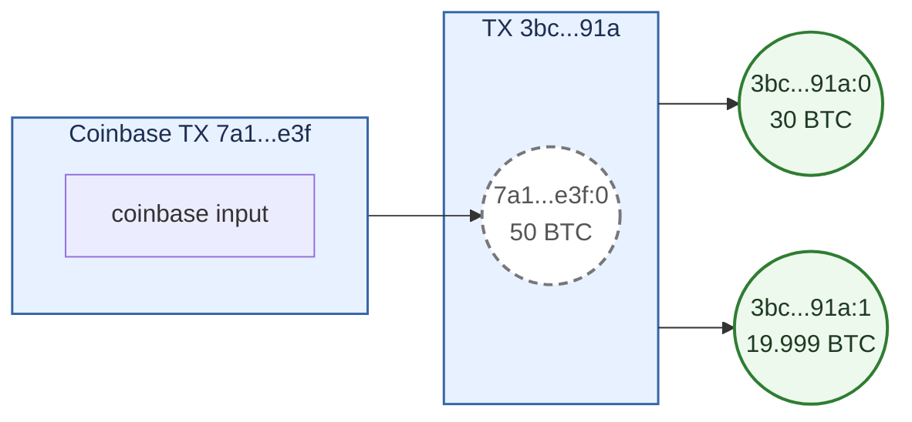

# Mermaid Demo

This page exists to demonstrate Mermaid support in the book build.

## UTXO Lifecycle Example

```mermaid
flowchart LR
    subgraph CB["Coinbase TX 7a1...e3f"]
        direction TB
        C["coinbase input"]
    end

    subgraph TX1["TX 3bc...91a"]
        direction TB
        U0((7a1...e3f:0<br/>50 BTC))
    end

    U1((3bc...91a:0<br/>30 BTC))
    U2((3bc...91a:1<br/>19.999 BTC))

    CB --> U0
    TX1 --> U1
    TX1 --> U2

    classDef utxo fill:#eef9ee,stroke:#2f7d32,stroke-width:2px,color:#1f3a22;
    classDef spent fill:#ffffff,stroke:#777,stroke-width:2px,stroke-dasharray: 6 4,color:#555;
    classDef tx fill:#e8f1ff,stroke:#3566a8,stroke-width:1.5px,color:#1d2f52;

    class U0 spent;
    class U1,U2 utxo;
    class CB,TX1 tx;
```
